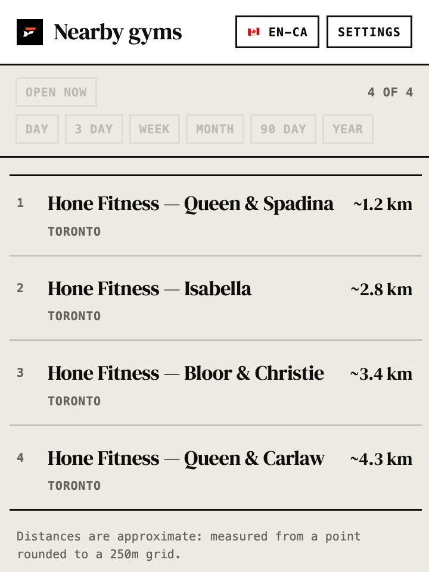
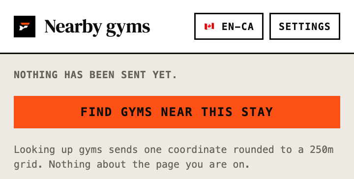
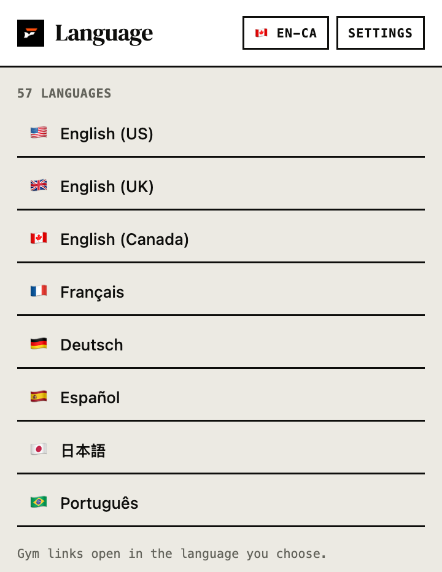

<p align="center">
  <picture>
    <source media="(prefers-color-scheme: dark)" srcset="docs/assets/ftnss-logo-dark.svg">
    
  </picture>
</p>

<h1 align="center">FTNSS Browser Extension</h1>

<p align="center">
  Shows which FTNSS gyms are near the hotel you are looking at —<br>
  without us ever seeing what you are browsing.
</p>

<p align="center">
  <a href="https://ftnss.fit">Website</a> ·
  <a href="#install-it-in-chrome">Install</a> ·
  <a href="#what-it-does">Features</a> ·
  <a href="#the-privacy-claim-and-how-to-check-it-yourself">Privacy</a> ·
  <a href="docs/DECISIONS.md">Decisions</a> ·
  <a href="#contributing">Contributing</a> ·
  <a href="mailto:hello@ftnss.fit">Contact</a>
</p>

<p align="center">
  <a href="https://github.com/FTNSS-FIT/FTNSS-Browser-Extension/actions/workflows/codeql.yml"></a>
  <a href="#what-this-is-technically"></a>
  <a href="#what-this-is-technically"></a>
  <a href="src/manifest.json"></a>
  <a href="LICENSE"></a>
</p>

<p align="center">
  <picture>
    <source media="(prefers-color-scheme: dark)" srcset="docs/assets/readme/panel-results-dark.png">
    
  </picture>
  <picture>
    <source media="(prefers-color-scheme: dark)" srcset="docs/assets/readme/panel-idle-dark.png">
    
  </picture>
  <picture>
    <source media="(prefers-color-scheme: dark)" srcset="docs/assets/readme/panel-languages-dark.png">
    
  </picture>
</p>

Open a hotel listing on Airbnb, Booking.com, Expedia, Hotels.com or Vrbo, click the icon, and see the
FTNSS gyms near that stay with walking distances and a link straight to each one. It reads the page
**only when you click**, and the only thing that ever leaves your browser is a single coordinate
rounded to a 250m grid — never the URL, the hotel, or anything else about what you were doing.

> **Not on the Chrome Web Store yet.** Load it unpacked; the next section is the five-minute version.
> The panel is the product and it works today. The measurement harness that came first is still in
> here, behind a developer-mode toggle in Settings.

## What it does

- **Nearby gyms, nearest first.** Up to six FTNSS gyms within 5km of the listing, each with an
  approximate distance and a link that opens the gym on the FTNSS site.
- **Reads the page only on click.** Nothing runs while you browse. There is no background crawl and
  no content script watching you type.
- **Fails closed, out loud.** When a page does not publish a usable location, the panel says the
  location could not be read. It never guesses, and it never picks one listing's coordinates off a
  page that describes several.
- **Distances are marked as estimates.** The query point is rounded before it is sent, so the answer
  is rounded too — `~1.2 km`, never `1,247 m`. Precision the input cannot support is a lie.
- **57 languages.** Pick one and gym links open on that version of the site. Only languages FTNSS
  actually serves are offered, because an unrecognised prefix silently 404s.
- **Pass filters and opening hours.** Day, 3-day, week, month, 90-day and year, plus an Open Now
  button. A filter with nothing behind it greys out rather than returning an empty list.

## Install it in Chrome

Five minutes, no build step, no `npm install` needed to *run* it.

**1. Get the code**

```bash
git clone https://github.com/FTNSS-FIT/FTNSS-Browser-Extension.git
```

**2. Open the extensions page**

Go to `chrome://extensions` — paste that into the address bar; it is not in a menu.

**3. Turn on Developer mode**

The toggle is in the **top right**. Nothing in the next step appears until it is on.

**4. Click "Load unpacked", and choose the `src` folder**

Not the repository folder — the **`src`** folder inside it. That is where `manifest.json` lives, and
Chrome will refuse the parent folder because it cannot find one there.

```
FTNSS-Browser-Extension/src      ← choose this
```

**5. Check it loaded**

An FTNSS entry appears in the list with a version number. Pin it from the puzzle-piece icon in the
toolbar if you want it visible.

### Using it

Open a listing on any supported site — Airbnb, Booking.com, Expedia, Hotels.com or Vrbo — and click
the extension. It reads the page **only when you click**, never while you browse.

The panel asks `https://ftnss.fit/api/proximity`, which is live. Chrome will ask for permission to
contact that host the first time you press **Find gyms near this stay** — the extension ships without
it, so installing it grants nothing until you say yes. Decline and nothing is sent.

### After you change the code

Chrome does **not** pick up edits automatically. Return to `chrome://extensions` and press the reload
arrow on the FTNSS card. The version number in the popup is there so you can confirm the reload
actually took — if it has not changed, Chrome is still running the old code.

### If something looks wrong

| What you see | What it means |
|---|---|
| No FTNSS entry after "Load unpacked" | You chose the repository folder instead of `src` |
| The extension is there but the popup is empty | The page has not finished loading; reopen the popup |
| "Nothing to search from" | The site published no coordinates on that page — expected on some sites |
| The panel lists gyms but no prices or hours | Expected today: the endpoint does not serve pass or hours data yet, so those fields are omitted rather than guessed |

## What this is, technically

**Plain JavaScript. No dependencies. No build step. No framework.** It loads unpacked and runs
exactly as written. The comments are dense on purpose: they carry the reasoning behind decisions that
would otherwise look arbitrary, and this is a repository whose main claim is that you can read it.

That is deliberate. A dependency tree is an extension's attack surface, and it is also source that
anyone checking the privacy claim below would have to audit. "No build step" means what runs in your
browser is byte-for-byte what is in this repository.

```bash
npm test                            # extractors against hostile input, plus the no-network and
                                    # permission assertions
node tools/screenshot-panels.mjs    # regenerate the panel images above from the real stylesheet
```

The screenshots at the top are **rendered from `src/popup/ftnss.css` itself**, not captured by hand,
so a design change that never reaches the README is hard to ship by accident. Both themes are
generated, because GitHub serves this page in either.

The measurement harness — tiers, timings and extraction reasons — is behind **Settings → developer
mode**. It answered the question this project opened with: how often can a listing page's location
actually be read. See [`docs/PHASE-1-FINDINGS.md`](docs/PHASE-1-FINDINGS.md).

**Chrome only, today.** Firefox and Safari are real work, not a switch — see
[`ARCHITECTURE.md`](ARCHITECTURE.md) for what each would cost.

## The privacy claim, and how to check it yourself

The claim is that this extension **cannot** see your browsing history — because of how it is built,
not because of a promise in a policy document. Three files let you verify that in about ninety
seconds:

| Check | Where |
|---|---|
| Which sites it can read — a short, named list, never `<all_urls>` | [`src/manifest.json`](src/manifest.json) |
| That coordinates really are truncated before transmission | `toTransmittablePoint` in [`src/lib/geo.js`](src/lib/geo.js) |
| That exactly **one** file can reach the network | [`tools/no-network.test.mjs`](tools/no-network.test.mjs) — every other source file fails the build if it so much as names `fetch` |
| What that one request contains | [`src/lib/proximity.js`](src/lib/proximity.js) — one body, built from one rounded coordinate |

Four properties carry the claim:

1. **Narrow permissions.** A short list of named sites. It is technically incapable of reading any
   other page — a limit enforced by the browser, not by us.
2. **The URL never leaves your browser.** Not the address bar, not the page title, not the content,
   not the hotel's name or address. Our servers cannot reconstruct what you were looking at,
   because it was never sent.

   **One request is made, and only when you press "Find gyms".** Opening the panel sends nothing;
   the request carries a single coordinate rounded to the grid below and nothing else — no cookies,
   no identifier, no session. You can watch it in devtools; that is the point of it being one small
   thing. Nothing is sent while you browse, and the measurements this build records stay on your
   machine.
3. **Coordinates are rounded before they are sent.** Cells 250m across — plenty to answer "is
   there a gym near this hotel", uselessly coarse as a location trail. The grid is **latitude-aware**:
   a fixed number of decimal places is ~1.1km near the equator and about 190m at 80°, so the
   longitude step is derived from the latitude.
4. **The source is public**, so none of the above has to be taken on trust.

### What it does not do

No payments and no card details — buying a pass hands off to the website. No third-party analytics,
advertising, or error-reporting SDKs, ever. No crawling: it reads the page you are already looking
at, on your machine, and **the reading itself never leaves it** — only a rounded coordinate derived
from it does, and only when you ask what is nearby.

The extension also cannot call anywhere it likes: the origins it may contact are named in the
manifest, and permission for one of them is requested at the moment you configure it rather than
granted up front.

## Reproducible builds

Every published version will be tagged at the exact commit it was built from. Today there is no build
step at all, which is the strongest form of that promise: the extension you load is the repository.

## Documentation

- [`ARCHITECTURE.md`](ARCHITECTURE.md) — how it runs, how it relates to the FTNSS platform, and where
  cross-browser support actually stands
- [`docs/DECISIONS.md`](docs/DECISIONS.md) — the architectural decisions and why
- [`docs/PHASE-1-FINDINGS.md`](docs/PHASE-1-FINDINGS.md) — **what the measurement actually found**
- [`docs/PHASE-1-MEASUREMENT.md`](docs/PHASE-1-MEASUREMENT.md) — the measurement protocol
- [`AGENTS.md`](AGENTS.md) — the standards a change is held to

## Contributing

Issues and pull requests are welcome, though we may decline changes that do not fit the project's
direction. Anything affecting permissions, network requests, or dependencies will be reviewed
closely.

Security reports: see [`SECURITY.md`](SECURITY.md). Please do not open a public issue for a
vulnerability.

## Licence

[MIT](LICENSE).
